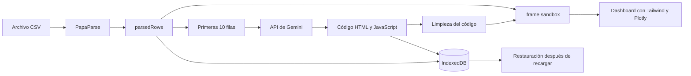

# Generador Dinámico de Dashboards Contables

Aplicación web local que transforma archivos CSV en dashboards contables interactivos mediante Google Gemini. Todo funciona directamente en el navegador: no requiere servidor propio, instalación de frontend ni base de datos remota.

Gemini recibe una muestra pequeña del archivo para comprender su estructura y generar el código del dashboard. Los cálculos finales se ejecutan localmente sobre los datos completos del CSV.

## Características

- Carga de archivos CSV mediante selección o arrastrar y soltar.
- Conversión de CSV a objetos JavaScript con PapaParse.
- Envío de solo 10 filas de muestra a Gemini.
- Generación dinámica de HTML, JavaScript, Tailwind CSS y gráficos Plotly.
- Procesamiento del CSV completo dentro del navegador.
- Instrucciones de análisis personalizadas por el usuario.
- Prompt técnico automático editable desde una sección avanzada.
- Ejecución aislada del código generado dentro de un `iframe sandbox`.
- Política CSP que limita los recursos y conexiones del dashboard generado.
- Persistencia del último dashboard y sus datos mediante IndexedDB.
- Restauración del último dashboard después de recargar la página.
- Vista del dashboard a pantalla completa.
- Regeneración cuando el resultado de la IA contiene errores o no es adecuado.
- Diagnóstico de respuestas y errores mediante la consola del navegador.
- Advertencia antes de recargar mientras Gemini está generando.

## Arquitectura



La aplicación tiene dos rutas de datos diferentes:

1. **Ruta de inteligencia artificial:** solo las primeras 10 filas se envían a Gemini para que pueda inferir columnas, tipos de datos y posibles visualizaciones.
2. **Ruta de procesamiento local:** el CSV completo permanece en el navegador y se entrega al código generado mediante `window.uploadedData`.

Esto permite que Gemini escriba los algoritmos sin recibir el documento completo. Por ejemplo, puede generar código que descubra categorías únicas y calcule totales:

```js
const categorias = [
  ...new Set(window.uploadedData.map((fila) => fila.Categoria)),
];

const totales = categorias.map((categoria) =>
  window.uploadedData
    .filter((fila) => fila.Categoria === categoria)
    .reduce((total, fila) => total + Number(fila.Monto || 0), 0),
);
```

Las categorías y los resultados no se copian desde las 10 filas de muestra: se calculan en tiempo de ejecución utilizando todo el CSV disponible localmente.

## Gestión de la API de Gemini

La API de Gemini es gestionada directamente por cada usuario de la aplicación.

El usuario debe proporcionar:

- Su propia API Key de Google Gemini.
- El modelo que desea utilizar.
- Instrucciones específicas para analizar sus datos, si las necesita.

La aplicación no incluye, comparte ni administra una clave central. Tampoco existe un backend intermediario: el navegador realiza la solicitud directamente al endpoint REST de Gemini utilizando la clave proporcionada.

```text
Navegador del usuario → API REST de Gemini
```

La clave se guarda en `localStorage` para evitar solicitarla en cada sesión. Esto impide que quede escrita en el código fuente, pero **no cifra ni vuelve secreta la clave**. Cualquier persona con acceso al navegador y sus herramientas de desarrollo podría inspeccionarla.

Por este motivo, la aplicación está pensada para uso local o controlado. Para una publicación abierta en Internet se recomienda utilizar un backend que proteja la clave y aplique autenticación, cuotas y límites de consumo.

## Cómo funciona

### 1. Configuración

El usuario abre el formulario **Configuración** e introduce:

- Nombre de la empresa.
- API Key de Gemini.
- Modelo Gemini.
- Instrucciones específicas para sus datos.

El prompt técnico del sistema se carga automáticamente y permanece oculto dentro de **Ver prompt base automático**. Puede editarse para casos avanzados.

La configuración se guarda en `localStorage`.

### 2. Lectura del CSV

PapaParse procesa el archivo con las siguientes opciones principales:

- La primera fila se interpreta como encabezado.
- Las filas vacías se omiten.
- Los valores numéricos y booleanos se convierten cuando es posible.
- Los nombres de las columnas se limpian con `trim()`.

El resultado queda temporalmente en:

```js
parsedRows
```

### 3. Solicitud a Gemini

Cuando se pulsa **Generar dashboard**, la aplicación toma un máximo de 10 filas:

```js
const sample = parsedRows.slice(0, 10);
```

La solicitud incluye:

- Prompt técnico del sistema.
- Reglas de ejecución dinámica.
- Instrucciones específicas escritas por el usuario.
- Nombre de la empresa.
- Número total de registros.
- Muestra JSON de 10 filas.

El CSV completo no se incluye en la solicitud.

### 4. Recepción y limpieza del código

Gemini devuelve HTML, CSS y JavaScript. Antes de utilizarlo, la aplicación:

- Elimina delimitadores Markdown como ` ```html `.
- Elimina etiquetas `base` y redirecciones automáticas.
- Descarta `iframe`, `object` y `embed` generados.
- Registra en consola tanto la respuesta original como el código limpio.

### 5. Ejecución aislada

El código generado no se inyecta directamente en la página principal. Se ejecuta dentro de un `iframe` con:

```html
<iframe sandbox="allow-scripts"></iframe>
```

El iframe no recibe `allow-same-origin`, por lo que el código generado no puede acceder al `localStorage`, a la API Key ni al DOM principal.

La política CSP permite únicamente:

- Scripts internos.
- Tailwind CSS desde jsDelivr.
- Plotly desde su CDN oficial.
- Imágenes locales `data:` o `blob:`.

Las conexiones de red iniciadas por el dashboard están bloqueadas mediante `connect-src 'none'`.

### 6. Conexión con los datos completos

Antes de ejecutar el resultado, la aplicación serializa el CSV completo dentro del iframe:

```js
window.uploadedData = [...];
```

La serialización escapa caracteres peligrosos para impedir que un valor del CSV cierre una etiqueta `<script>` e introduzca código adicional.

El código generado puede recorrer `window.uploadedData` con `map`, `filter`, `reduce`, conjuntos de valores únicos y agrupaciones dinámicas.

### 7. Resultado y persistencia

Cuando Gemini termina:

- El dashboard no se abre automáticamente.
- Aparece una tarjeta indicando que está listo.
- El usuario puede seleccionar **Ver dashboard**.
- También puede elegir **Generar nuevamente**.

El código generado, los datos procesados, el nombre del archivo y la fecha se guardan en IndexedDB. Al recargar, la aplicación intenta restaurar el último resultado.

Si se recarga mientras la petición todavía está en curso, el navegador muestra una advertencia. Si el usuario confirma la recarga, la conexión con esa petición se pierde y debe generarse nuevamente.

## Almacenamiento local

### localStorage

Se utiliza para preferencias pequeñas:

- API Key.
- Nombre de la empresa.
- Modelo Gemini.
- Prompt técnico.
- Instrucciones específicas del usuario.

### IndexedDB

Se utiliza para información de mayor tamaño:

- Código del último dashboard.
- Datos del CSV utilizados por ese dashboard.
- Nombre del archivo.
- Cantidad de registros.
- Fecha de generación.

El botón **Borrar datos** elimina tanto la configuración como el dashboard almacenado.

## Archivos principales

| Archivo | Responsabilidad |
| --- | --- |
| `index.html` | Estructura de la aplicación, formulario, carga del CSV y zona de renderizado. |
| `style.css` | Diseño principal, modal, estados, tarjeta de resultado y vista a pantalla completa. |
| `app.js` | Lectura del CSV, configuración, API REST, seguridad, iframe, persistencia y diagnóstico. |
| `recortar_archivo.py` | Herramienta auxiliar para crear versiones reducidas de archivos CSV o XLSX. |

## Dependencias externas

La aplicación carga las dependencias mediante CDN:

- **PapaParse:** lectura de archivos CSV.
- **Tailwind CSS Browser:** estilos utilizados por el dashboard generado.
- **Plotly.js:** gráficos interactivos.
- **Google Fonts:** tipografías de la interfaz principal.

Por ello, aunque el archivo CSV se procesa localmente, se necesita conexión a Internet para cargar estas dependencias y comunicarse con Gemini.

## Ejecución

Puede abrirse `index.html` directamente en un navegador moderno. Para evitar restricciones asociadas al protocolo `file://`, también puede servirse con Python:

```bash
python3 -m http.server 8000
```

Después abre:

```text
http://localhost:8000
```

## Archivos CSV muy grandes

La implementación actual conserva el CSV completo como objetos JavaScript y posteriormente lo serializa para el iframe. Esto funciona bien con archivos pequeños o medianos, pero no es adecuado para archivos con cientos de miles o millones de filas.

Un CSV grande puede ocupar varias veces su tamaño original después de convertirse en objetos JavaScript. Además, temporalmente puede existir en más de una representación:

```text
CSV → resultados de PapaParse → parsedRows → IndexedDB → JSON del iframe
```

Para reducir un archivo antes de cargarlo puede utilizarse:

```bash
python3 recortar_archivo.py archivo.csv 10000
```

La cantidad indicada corresponde a filas de datos y no incluye la cabecera.

La evolución recomendada para soportar millones de filas es implementar un modo de archivos grandes basado en:

- PapaParse por bloques.
- Web Worker.
- Agregaciones incrementales.
- Envío al dashboard de resúmenes compactos en lugar del CSV completo.
- IndexedDB por lotes o DuckDB-WASM cuando se necesiten consultas detalladas.

## Seguridad y limitaciones

- El código generado por IA puede contener errores lógicos o visuales.
- Siempre debe revisarse el resultado antes de utilizarlo para decisiones contables.
- El aislamiento reduce el riesgo, pero no convierte el código generado en código auditado.
- La API Key almacenada en el navegador no es apropiada para una aplicación pública de producción.
- Solo 10 filas llegan a Gemini; estas podrían no representar todos los casos especiales del archivo.
- La calidad del dashboard depende de los encabezados, consistencia y calidad del CSV.
- Las advertencias de mapas de fuentes de las librerías CDN no suelen impedir el funcionamiento del dashboard.

## Diagnóstico

La consola del navegador muestra:

- Respuesta JSON completa de Gemini.
- Código devuelto por el modelo.
- Código limpio enviado al iframe.
- Confirmación de carga del iframe.
- Número de filas locales disponibles.
- Cantidad de elementos visibles y gráficos Plotly.
- Errores de JavaScript con línea y columna.

Para abrirla:

```text
F12 → Console
```

Si el dashboard no aparece, revise primero los mensajes `Gemini API` y `Dashboard · diagnóstico visual`.

